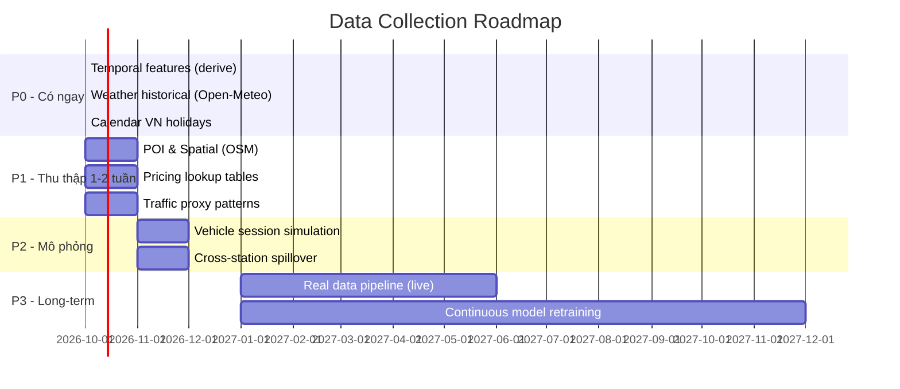

# 🔍 Phân tích Data Gap toàn diện — V-EVNET ML System

**Ngày phân tích:** 2026-09-29  
**Tham chiếu:** [PHASE_03](file:///d:/Code/open-charge-map/Reference/PHASE_03_URBANEV_PREPROCESSING.md) · [PHASE_04](file:///d:/Code/open-charge-map/Reference/PHASE_04_OCCUPANCY_MODEL.md) · [LSTM_Markov](file:///d:/Code/open-charge-map/Reference/LSTM_Markov_head_thoi_gian_cho.md)

---

## 1. Hiện trạng Data — Mình đang có gì

### 1.1 UrbanEV Processed (Phase 03 — PASS)

| Thuộc tính | Giá trị |
|---|---|
| Records | 2,606,400 rows |
| Stations | 50 |
| Resolution | 5 phút |
| Time range | 2022-09-01 → 2023-02-28 (6 tháng) |
| Target | `occupancy_ratio` ∈ [0, 1] |

**Columns hiện có:**

```
timestamp, entity_id, entity_level, interval_min,
total_ports, occupied_ports, occupancy_ratio, split, data_source
```

### 1.2 Static Data (Phase 00)
- `stations.geojson` — tọa độ, tên, địa chỉ, connectors, total_ports
- `vehicles.json` — battery capacity, connector types, consumption

### 1.3 Runtime/Demo Data (Phase 01)
- `station_status.json` — snapshot trạng thái hiện tại
- `planned_arrivals.json` — lịch đặt trước
- `queue_assumptions.json` — arrival rate nền synthetic

> [!WARNING]
> **Tóm tắt:** Data hiện tại chỉ có **1 domain duy nhất** — chuỗi thời gian occupancy thuần túy. Không có bất kỳ context bên ngoài nào (thời tiết, giao thông, POI, giá điện, sự kiện...). Đây là hạn chế lớn nhất.

---

## 2. Bài toán mình cần giải — Features cần cho mô hình

### 2.1 Từ LSTM + Markov head (Reference doc)

File LSTM_Markov mô tả rõ vector đầu vào gồm **2 nhánh**:

| Nhánh | Nội dung yêu cầu | Hiện có? |
|---|---|---|
| **Chuỗi (→ LSTM)** | _m_ bước trạng thái gần nhất y₋ₘ₊₁,...,y₀ + mã giờ sin/cos | ✅ Có (từ occupancy) |
| **Ngữ cảnh (→ MLP)** | Giờ & thứ tại T, cuối tuần/lễ, embedding trạm, loại trụ, công suất, **tuổi trạng thái**, hazard nền theo khung giờ | ⚠️ Có một phần |

**Chi tiết features trong nhánh Ngữ cảnh:**

| Feature | Mô tả | Hiện có? | Nguồn để thu thập |
|---|---|---|---|
| Giờ sin/cos | Mã hóa tuần hoàn giờ trong ngày | ✅ Derive từ timestamp | — |
| Thứ trong tuần | Mon-Sun encoding | ✅ Derive từ timestamp | — |
| Cuối tuần / Lễ | Binary flag | ⚠️ Weekend derive được, **lễ thì không** | Calendar API / bảng ngày lễ VN |
| Embedding trạm | Vector đặc trưng per-station | ⚠️ Có station_id nhưng chưa có rich embedding | Cần spatial + POI context |
| Loại trụ sạc | AC/DC, power rating | ⚠️ Có trong stations.geojson (connectors) | Đã có |
| Công suất trạm | total_ports, max power | ✅ Có | — |
| **Tuổi trạng thái** | Đã ở trạng thái hiện tại bao lâu | ❌ Chưa tính | Derive từ occupancy sequence |
| Hazard nền theo giờ | Baseline r_k, b_k từ life-table | ❌ Chưa tính | Compute từ train data |

### 2.2 Từ Phase 04 (Occupancy Forecast Model)

| Yêu cầu | Hiện có? |
|---|---|
| Historical occupancy sequence | ✅ |
| Capacity/occupancy ratio | ✅ |
| Deterministic temporal encoding (from timestamp) | ✅ Derive được |
| Lag features (12 bước = 60 phút lookback) | ❌ Chưa tạo (sẽ tạo khi feature engineering) |
| Forecast horizons +5, +10, +15 phút | ❌ Chưa tạo |

---

## 3. Data Domains cần thu thập — Phân tích từng nhóm

### 🌤️ Domain 1: WEATHER (Thời tiết)

> [!IMPORTANT]
> **Tại sao quan trọng:** Thời tiết ảnh hưởng trực tiếp đến:
> - Hành vi di chuyển (mưa → ít người ra đường → demand giảm)
> - Hiệu suất pin (nhiệt độ thấp → pin yếu → cần sạc nhiều hơn)
> - Mùa mưa/khô VN tạo seasonal pattern rõ rệt

| Feature | Resolution | Nguồn khả thi | Khó/dễ thu thập |
|---|---|---|---|
| Nhiệt độ (°C) | Hàng giờ | OpenWeatherMap, Visual Crossing, Open-Meteo | 🟢 Dễ — API miễn phí |
| Độ ẩm (%) | Hàng giờ | Như trên | 🟢 Dễ |
| Lượng mưa (mm) | Hàng giờ | Như trên | 🟢 Dễ |
| Tốc độ gió (km/h) | Hàng giờ | Như trên | 🟢 Dễ |
| Mã thời tiết (clear/rain/storm) | Hàng giờ | Như trên | 🟢 Dễ |
| UV Index | Hàng ngày | Như trên | 🟢 Dễ |
| **Chỉ số AQI** | Hàng giờ | IQAir, OpenAQ | 🟡 Trung bình |

**Cách thu thập cho mô phỏng:**
- Open-Meteo cho phép lấy **historical weather data miễn phí** theo tọa độ và time range
- Resolution 1 giờ → resample về 5 phút bằng interpolation
- Cần ~6 tháng data khớp time range UrbanEV (2022-09 → 2023-02)

**Giá trị cho model:**
- Temperature + Rain là 2 features mạnh nhất theo research
- Có thể tạo derived features: `is_raining`, `temperature_bucket`, `comfort_index`

---

### 🚗 Domain 2: TRAFFIC (Giao thông)

> [!IMPORTANT]
> **Tại sao quan trọng:** Traffic flow ≈ proxy cho số lượng xe trên đường → tương quan trực tiếp với arrival rate tại trạm sạc

| Feature | Resolution | Nguồn khả thi | Khó/dễ |
|---|---|---|---|
| Traffic density quanh trạm | 15 phút | Google Maps Platform, TomTom | 🟡 Có phí / rate limit |
| Tốc độ trung bình đường | 15 phút | HERE Traffic, Goong (VN) | 🟡 |
| Congestion level (0-10) | 15 phút | Google Routes API | 🟡 |
| Số vụ tai nạn/sự cố | Event-based | NewsAPI, police reports | 🔴 Khó |
| **Lưu lượng xe qua trạm cân** | Hàng giờ | Dữ liệu giao thông VN (nếu có) | 🔴 Rất khó |

**Thực tế cho mô phỏng:**
- Historical traffic data rất khó lấy miễn phí
- **Giải pháp:** Mô phỏng traffic patterns dựa trên:
  - Hour-of-day profiles (rush hour 7-9, 17-19)
  - Day-of-week patterns (weekday vs weekend)
  - Seasonal adjustments
- Hoặc dùng **OSM traffic model** để estimate

**Giá trị cho model:**
- Traffic là leading indicator: xe trên đường → 15-30 phút sau sẽ cần sạc
- Đặc biệt hữu ích cho short-term forecast (+5, +10, +15 phút)

---

### 📍 Domain 3: POI & SPATIAL (Điểm quan tâm & Không gian)

> [!IMPORTANT]
> **Tại sao quan trọng:** Vị trí trạm quyết định **profile hành vi** hoàn toàn khác nhau:
> - Trạm ở mall → peak buổi chiều-tối, weekend
> - Trạm ở khu dân cư → peak đêm (sạc qua đêm)
> - Trạm ở highway → peak ngày, đặc biệt holiday

| Feature | Tĩnh/Động | Nguồn khả thi | Khó/dễ |
|---|---|---|---|
| **Loại vị trí** (mall/residential/highway/office) | Tĩnh | Overpass/OSM, Google Places | 🟢 Dễ |
| Số POI trong bán kính 500m | Tĩnh | OSM Overpass API | 🟢 Dễ |
| Loại POI (restaurant, shopping, park, hospital) | Tĩnh | OSM / Google Places | 🟢 Dễ |
| Population density quanh trạm | Tĩnh | Census data, WorldPop | 🟡 |
| Khoảng cách đến trung tâm thành phố | Tĩnh | Tính từ coordinates | 🟢 |
| Số trạm sạc đối thủ trong bán kính | Tĩnh | OpenChargeMap API | 🟢 |
| **Parking capacity** tại vị trí | Tĩnh | Manual survey / Google Maps | 🟡 |
| Loại đường (quốc lộ/nội đô/hẻm) | Tĩnh | OSM highway tags | 🟢 |

**Giá trị cho model:**
- Tạo **station embedding** giàu ngữ cảnh thay vì one-hot ID
- Cho phép **transfer learning** — model học được pattern "trạm ở mall" từ trạm A → áp dụng cho trạm B mới mở
- Đây là domain mà **thị trường hầu như chưa thu thập kỹ** cho context VN

---

### ⚡ Domain 4: PRICING & ENERGY (Giá điện & Năng lượng)

| Feature | Resolution | Nguồn khả thi | Khó/dễ |
|---|---|---|---|
| Giá điện theo giờ (VNĐ/kWh) | Theo khung giờ | EVN / công khai | 🟢 |
| Giá sạc tại trạm (VNĐ/kWh) | Per-session | V-Green app, website | 🟡 |
| **Chênh lệch giá** sạc tại nhà vs trạm | Daily | Tính từ giá EVN | 🟢 |
| Giá xăng (đối thủ cạnh tranh) | Weekly | Petrolimex website | 🟢 |
| Peak/off-peak pricing flag | Theo khung giờ | Quy định EVN | 🟢 |

**Giá trị cho model:**
- Giá ảnh hưởng **hành vi lựa chọn** — giá thấp ban đêm → nhiều người sạc đêm
- Chênh lệch giá sạc nhà vs trạm → demand shift
- **Thị trường chưa quan tâm domain này** vì VN mới có EV market, chưa có dynamic pricing

---

### 📅 Domain 5: CALENDAR & EVENTS (Lịch & Sự kiện)

> [!TIP]
> **Đây là domain "ẩn" mà ít ai thu thập nhưng impact rất lớn** — đặc biệt cho bài toán dự đoán dài hạn (seasonal patterns)

| Feature | Resolution | Nguồn khả thi | Khó/dễ |
|---|---|---|---|
| Ngày lễ VN (Tết, 30/4, 2/9...) | Binary | Bảng cố định | 🟢 |
| Ngày nghỉ lễ kéo dài | Multi-day flag | Quy định nhà nước | 🟢 |
| **Mùa du lịch** (hè, Tết) | Monthly flag | Kinh nghiệm / dữ liệu du lịch | 🟢 |
| Sự kiện lớn (festival, concert, match) | Event-based | Ticketbox, news crawl | 🔴 Khó |
| Lịch học kỳ (đại học, phổ thông) | Semester flag | Bộ GD-ĐT | 🟡 |
| **Ngày trả lương** (25-28 hàng tháng) | Monthly cycle | Kinh nghiệm | 🟢 |
| Giờ cao điểm đi làm | Daily pattern | Khảo sát / standard | 🟢 |

**Vì sao domain này đặc biệt cho VN:**
- Tết Nguyên Đán → demand tăng vọt trên cao tốc, giảm mạnh nội thành
- Mùa mưa (tháng 5-11 ở miền Nam) → giảm di chuyển xe máy nhưng tăng ô tô
- Ngày trả lương → shopping tăng → traffic tăng → demand sạc tăng

---

### 🔋 Domain 6: VEHICLE & USER BEHAVIOR (Hành vi xe & người dùng)

> [!NOTE]
> Domain này là **khó thu thập nhất** nhưng có impact cao nhất cho bài toán wait time

| Feature | Resolution | Nguồn | Khó/dễ |
|---|---|---|---|
| SoC khi đến trạm | Per-session | Chỉ có từ OCPP/charger | 🔴 |
| Thời gian sạc trung bình | Per-session | Charger logs | 🔴 |
| Loại xe (VF5/VF8/VF9/hãng khác) | Per-session | Registration / camera | 🔴 |
| **Charging session duration** | Per-session | Charger logs | 🔴 |
| Return frequency (bao lâu quay lại) | Per-user | User tracking | 🔴 |
| Hành vi rời trạm khi đầy | Per-session | Charger logs | 🔴 |

**Thực tế:**
- Dữ liệu này **chỉ VinFast/V-Green nắm** — không public
- Giải pháp: **Mô phỏng từ phân phối thống kê** dựa trên battery specs + research papers
- Ví dụ: VF8 (87.7 kWh) từ 20% → 80% DC 150kW ≈ 35 phút → model session duration

---

### 🏗️ Domain 7: INFRASTRUCTURE & COMPETITION (Hạ tầng & Cạnh tranh)

| Feature | Tĩnh/Động | Mô tả | Khó/dễ |
|---|---|---|---|
| Số trạm mới mở trong khu vực | Monthly | V-Green expansion tracking | 🟡 |
| **Brand lock-in** (VinFast-only vs open) | Tĩnh | Phân loại trạm | 🟢 |
| Số lượng xe EV đăng ký trong khu vực | Quarterly | Số liệu đăng kiểm | 🟡 |
| Tỷ lệ EV / tổng xe trong khu vực | Quarterly | Thống kê ĐKVN | 🟡 |
| **Competitor station proximity** | Tĩnh | OpenChargeMap crawl | 🟢 |

---

## 4. Data Domains mà thị trường CHƯA thu thập kỹ (Cơ hội)

> [!TIP]
> Đây là những domain mà nếu mình thu thập/mô phỏng tốt, sẽ tạo **competitive advantage** so với các nghiên cứu hiện có

### 4.1 🇻🇳 Behavioral Patterns đặc thù Việt Nam
Thị trường quốc tế nghiên cứu nhiều nhưng **không có data VN**, trong khi hành vi VN rất khác:

| Pattern VN đặc thù | Mô tả | Cách thu thập |
|---|---|---|
| **Xe máy điện vs Ô tô điện** | VN có 2 phân khúc rất khác nhau | Phân loại theo connector type |
| Sạc tại nhà vs trạm công cộng | Người VN ưu tiên sạc nhà nếu có điều kiện | Khảo sát / mô phỏng |
| Thói quen đi chợ/cafe sáng | Morning rush đặc thù VN (5:30-7:00) | Time-of-day analysis |
| **Grab/Be driver patterns** | Xe dịch vụ sạc nhiều lần/ngày, pattern riêng | Mô phỏng từ shift schedules |
| Mùa mưa vs mùa khô miền Nam | Ảnh hưởng di chuyển rõ rệt theo tháng | Weather data + seasonal flag |

### 4.2 ⚡ Real-time Grid Load
- Tải lưới điện theo vùng → ảnh hưởng khả năng sạc nhanh
- **Chưa ai thu thập** cho context EV charging ở VN
- Có thể mô phỏng từ thống kê EVN

### 4.3 🛣️ Highway vs Urban Pattern
- Trạm trên cao tốc có pattern hoàn toàn khác trạm nội thành
- Research hiện tại thường gộp chung → mất signal
- Cần **phân loại và train riêng** hoặc dùng conditional features

### 4.4 📊 Cross-station Demand Spillover
- Khi trạm A đầy → demand chuyển sang trạm B gần nhất
- **Chưa có research nào model hiệu ứng này tốt** cho VN
- Cần data: khoảng cách giữa các trạm + real-time status cùng lúc

---

## 5. Feature Inventory — Bảng tổng hợp ưu tiên thu thập

| # | Domain | Feature Group | Ưu tiên | Khả thi mô phỏng | Impact cho model |
|---|---|---|---|---|---|
| 1 | **Temporal** | Hour/Day/Week/Month encoding, Holiday, Season | 🔴 P0 | ✅ Derive từ timestamp | ⭐⭐⭐⭐⭐ |
| 2 | **Weather** | Temperature, Rain, Humidity, Weather code | 🔴 P0 | ✅ Historical API miễn phí | ⭐⭐⭐⭐⭐ |
| 3 | **Calendar** | Lễ VN, Mùa du lịch, Lịch học kỳ, Ngày lương | 🔴 P0 | ✅ Bảng lookup | ⭐⭐⭐⭐ |
| 4 | **POI/Spatial** | Location type, POI count, Population density | 🟡 P1 | ✅ OSM API | ⭐⭐⭐⭐ |
| 5 | **Pricing** | Giá điện, Giá sạc, Peak/off-peak | 🟡 P1 | ✅ Bảng cố định | ⭐⭐⭐ |
| 6 | **Traffic** | Rush hour proxy, Congestion level | 🟡 P1 | ⚠️ Mô phỏng từ patterns | ⭐⭐⭐⭐ |
| 7 | **Infrastructure** | Station count nearby, Brand openness | 🟢 P2 | ✅ OpenChargeMap | ⭐⭐⭐ |
| 8 | **Vehicle/Session** | SoC arrival, Session duration, Vehicle type | 🟢 P2 | ⚠️ Mô phỏng từ specs | ⭐⭐⭐⭐⭐ |
| 9 | **Grid/Energy** | Grid load, Power availability | 🔵 P3 | ⚠️ Khó | ⭐⭐ |
| 10 | **Competition** | EV registration count, Market growth | 🔵 P3 | ⚠️ Quarterly only | ⭐⭐ |

---

## 6. Chiến lược thu thập & Scale — Roadmap đề xuất

### 6.1 Nguyên tắc thu thập

```
Thu thập 24h × 365 ngày × 5-phút resolution = 105,120 timesteps/station/năm
```

**Tại sao cần ít nhất 1 năm:**
- Bao gồm **4 mùa** (mưa/khô, nóng/lạnh)
- Bao gồm **Tết Nguyên Đán** (pattern đặc biệt nhất năm)
- Bao gồm **mùa du lịch hè** (tháng 6-8)
- Bao gồm **các ngày lễ lớn** (30/4, 2/9, Giáng sinh)
- Đủ để detect **weekly seasonality** (52 tuần)
- Đủ để detect **monthly trend** (12 tháng)

### 6.2 Phase thu thập đề xuất



### 6.3 Chiến lược Scale lên DL/Transformer

| Giai đoạn | Model | Data cần | Khi nào |
|---|---|---|---|
| **MVP** | XGBoost + lag features | Occupancy + temporal | Ngay (Phase 04) |
| **V1** | LSTM + Markov head | + Weather + Calendar + POI | Sau khi thu thập P0+P1 |
| **V2** | Transformer (temporal attention) | + Traffic + Session simulation | Khi có đủ 1 năm data |
| **V3** | Foundation model fine-tune | Multi-station + all domains | Khi có real-time pipeline |

**Về Foundation Models / Pretrained:**
- **TimesFM** (Google) — pretrained time series model, có thể fine-tune cho EV occupancy
- **Lag-Llama** — foundation model cho probabilistic time series
- **Chronos** (Amazon) — pretrained temporal model
- Yêu cầu: **tối thiểu ~10K-50K time series samples** để fine-tune hiệu quả
- Hiện tại 50 stations × 6 tháng ≈ 2.6M rows → **đủ samples, thiếu diversity (chỉ 1 domain)**

---

## 7. Tổng kết Data Gap

### Có rồi ✅
- Occupancy time series 5-phút, 50 stations, 6 tháng
- Static station metadata (vị trí, capacity, connectors)
- Temporal features (derivable)

### Thiếu nghiêm trọng ❌
- **Weather** — cần nhất, dễ lấy nhất → **làm ngay**
- **Calendar/Holiday VN** — cực kỳ quan trọng cho seasonal → **làm ngay**
- **Station context** (POI, location type) — cần cho transfer learning
- **Session-level data** (SoC, duration) — cần cho wait time prediction

### Chưa ai thu thập cho VN 🌟
- Behavioral patterns xe điện VN (Grab drivers, xe máy điện, sạc nhà vs trạm)
- Cross-station demand spillover effect
- Brand lock-in impact (VinFast-only vs open network)
- Highway vs Urban station profiling
- Real-time grid load correlation

### Khuyến nghị hành động ngay
1. **Thu thập Weather data** cho time range UrbanEV qua Open-Meteo API
2. **Tạo bảng Calendar VN** (lễ, mùa, events) cho 2022-2023
3. **Bắt đầu Phase 04 XGBoost** với temporal features → baseline metric
4. **Song song: thiết kế data schema** cho multi-domain ingestion
5. **Mô phỏng session data** dựa trên battery specs của VinFast

> [!IMPORTANT]
> **Kết luận:** Data hiện tại đủ cho XGBoost baseline (Phase 04) nhưng **không đủ để scale lên LSTM+Markov hay Transformer**. Cần ít nhất thêm Weather + Calendar + POI context trước khi chuyển sang DL. Tin tốt là 2/3 domain P0 đều có thể thu thập/derive miễn phí trong 1-2 ngày.
