# Database ERD và thống kê dữ liệu

**Schema revision:** `0006_trip_tokens`
**Đo lúc:** `2026-10-09T14:09:44Z` (`2026-10-09 21:09:44` Asia/Ho_Chi_Minh)
**Database:** `smart_ev_data` — PostgreSQL 16 + PostGIS 3.4
**Phạm vi:** 18 bảng nghiệp vụ của Smart EV; không tính các bảng hệ thống PostGIS/Tiger
và các bảng partition vật lý.

## ERD

```mermaid
erDiagram
    STATIONS {
        uuid id PK
        text code UK
        text name
        geography location
        jsonb opening_hours
        access_level access_level
        boolean is_active
        jsonb provenance
    }

    STATION_EXTERNAL_REFS {
        uuid id PK
        uuid station_id FK
        text provider
        text external_id
        boolean is_primary
    }

    CONNECTOR_TYPES {
        text code PK
        current_type current_type
        text display_name
    }

    PORTS {
        uuid id PK
        uuid station_id FK
        text connector_code FK
        text label
        numeric max_power_kw
        data_origin data_origin
        boolean is_active
    }

    PORT_STATUS {
        uuid port_id PK, FK
        port_status_value status
        timestamptz reported_at
        timestamptz estimated_finish_at
        data_origin data_origin
    }

    STATION_LIVE_METRICS {
        uuid station_id PK, FK
        integer queue_length
        numeric avg_session_duration_min
        timestamptz reported_at
        data_origin data_origin
    }

    PORT_STATUS_HISTORY {
        uuid id PK
        timestamptz changed_at PK
        uuid port_id FK
        port_status_value status
        data_origin data_origin
        uuid simulation_run_id
    }

    STATION_OCCUPANCY_5M {
        uuid id PK
        timestamptz bucket_at PK
        uuid station_id FK
        smallint total_ports
        smallint operational_ports
        smallint occupied_ports
        integer queue_length
        data_origin data_origin
    }

    PREDICTIONS {
        uuid station_id PK, FK
        timestamptz run_at PK
        smallint horizon_min PK
        numeric predicted_occupancy_ratio
        prediction_source prediction_source
        text model_version
    }

    STATION_AMENITIES {
        uuid id PK
        uuid station_id FK
        text amenity_code
        boolean is_available
        timestamptz verified_at
        jsonb provenance
    }

    VEHICLE_MODELS {
        uuid id PK
        text code UK
        text brand
        text model
        numeric battery_kwh
        numeric consumption_kwh_per_100km
        numeric max_ac_kw
        numeric max_dc_kw
        boolean is_active
        jsonb provenance
    }

    VEHICLE_CONNECTORS {
        uuid vehicle_model_id PK, FK
        text connector_code PK, FK
    }

    STATION_ARRIVAL_RATES {
        uuid station_id PK, FK
        numeric baseline_arrival_rate_per_hour
        text data_source
        jsonb provenance
    }

    PLANNED_ARRIVALS {
        text arrival_id PK
        uuid station_id FK
        uuid vehicle_model_id FK
        timestamptz eta_at
        numeric arrival_probability
        text status
        text data_source
        jsonb provenance
    }

    TRIPS {
        uuid id PK
        uuid vehicle_model_id FK
        uuid station_id FK
        text mode
        text phase
        geography origin
        geography destination
        geography route
        integer route_version
        text auth_token_hash
        jsonb planned
        timestamptz created_at
        timestamptz ended_at
    }

    TRIP_POSITIONS {
        uuid trip_id PK, FK
        timestamptz recorded_at PK
        geography location
        numeric battery_pct
        numeric speed_kmh
        numeric distance_km
    }

    TRIP_EVENTS {
        uuid id PK
        uuid trip_id FK
        timestamptz created_at
        text type
        jsonb payload
    }

    APP_CONFIG {
        text key PK
        jsonb value
        timestamptz updated_at
    }

    STATIONS ||--o{ STATION_EXTERNAL_REFS : "has external refs"
    STATIONS ||--|{ PORTS : "owns"
    CONNECTOR_TYPES ||--o{ PORTS : "classifies"
    PORTS ||--o| PORT_STATUS : "has current status"
    PORTS ||--o{ PORT_STATUS_HISTORY : "records history"
    STATIONS ||--o| STATION_LIVE_METRICS : "has live metrics"
    STATIONS ||--o{ STATION_OCCUPANCY_5M : "has 5-minute history"
    STATIONS ||--o{ PREDICTIONS : "receives forecasts"
    STATIONS ||--o{ STATION_AMENITIES : "offers"
    STATIONS ||--o| STATION_ARRIVAL_RATES : "has baseline rate"
    STATIONS ||--o{ PLANNED_ARRIVALS : "receives arrivals"
    VEHICLE_MODELS o|--o{ PLANNED_ARRIVALS : "may identify vehicle"
    VEHICLE_MODELS ||--o{ VEHICLE_CONNECTORS : "supports"
    CONNECTOR_TYPES ||--o{ VEHICLE_CONNECTORS : "maps compatibility"
    VEHICLE_MODELS ||--o{ TRIPS : "is used by"
    STATIONS o|--o{ TRIPS : "may be selected by"
    TRIPS ||--o{ TRIP_POSITIONS : "records GPS"
    TRIPS ||--o{ TRIP_EVENTS : "records lifecycle"
```

`port_status_history` và `station_occupancy_5m` được partition theo tháng. Schema hiện
có partition cho tháng 09, 10 và 11/2026. `app_config` là bảng cấu hình độc lập nên không
có khóa ngoại.

## Số lượng bản ghi

| Nhóm | Bảng | Số dòng |
|---|---|---:|
| Catalog trạm | `stations` | 102 |
| Catalog trạm | `station_external_refs` | 14 |
| Catalog trạm | `connector_types` | 4 |
| Catalog trạm | `ports` | 826 |
| Runtime | `port_status` | 826 |
| Runtime | `station_live_metrics` | 102 |
| Lịch sử | `port_status_history` | 826 |
| Lịch sử | `station_occupancy_5m` | 4.624 |
| Dự báo | `predictions` | 96 |
| Ngữ cảnh | `station_amenities` | 714 |
| Xe | `vehicle_models` | 21 |
| Xe | `vehicle_connectors` | 41 |
| Queue | `station_arrival_rates` | 102 |
| Queue | `planned_arrivals` | 4 |
| Trip | `trips` | 0 |
| Trip | `trip_positions` | 0 |
| Trip | `trip_events` | 0 |
| Cấu hình | `app_config` | 1 |

Dung lượng toàn database là khoảng **24 MB**. Con số này gồm extension và bảng hệ thống
PostGIS/Tiger, không chỉ 18 bảng nghiệp vụ phía trên.

## Coverage và provenance

| Hạng mục | Coverage hiện tại | Nguồn synthetic |
|---|---:|---:|
| Trạm active | 102/102 (100%) | Tùy từng field trong `provenance` |
| Trạm có trạng thái cho toàn bộ port | 102/102 (100%) | 826/826 port status |
| Trạm có queue/session live metrics | 102/102 (100%) | 102/102 |
| Trạm có baseline arrival rate | 102/102 (100%) | 102/102 |
| Trạm có opening hours | 102/102 (100%) | 95/102 được bổ sung |
| Trạm có access xác định | 102/102 (100%) | 79/102 được bổ sung |
| Trạm có occupancy history | 16/102 (15,7%) | 4.624/4.624 dòng |
| Trạm có prediction | 16/102 (15,7%) | persistence fallback |

Arrival rate gồm **16** giá trị từ `queue_assumptions_fixture` và **86** giá trị được
tạo deterministic bởi `deterministic_demo_fill_v1`. Seed không ghi đè dữ liệu observed.

## Phân bố chính

### Trạm và quyền truy cập

| Access | Số trạm | Tỷ lệ |
|---|---:|---:|
| Public | 98 | 96,1% |
| Customers | 3 | 2,9% |
| Private | 1 | 1,0% |

Phạm vi địa lý của 102 trạm: longitude `106.44254–107.05496`, latitude
`10.53288–11.02709`.

### Cổng sạc

| Connector | Số port | Tỷ lệ | Công suất min–max | Trung bình |
|---|---:|---:|---:|---:|
| CCS2 | 712 | 86,2% | 20–250 kW | 85,0 kW |
| TYPE2 | 114 | 13,8% | 3,5–22 kW | 14,3 kW |

| Trạng thái hiện tại | Số port | Tỷ lệ |
|---|---:|---:|
| Available | 758 | 91,8% |
| Charging | 55 | 6,7% |
| Out of service | 13 | 1,6% |

Timestamp trạng thái nằm trong khoảng `2026-09-25T11:00:00Z` đến
`2026-09-26T17:00:00Z`. Toàn bộ 826 trạng thái hiện tại mang nhãn synthetic.

### Dự báo và lịch sử

- `station_occupancy_5m`: 4.624 dòng của 16 trạm, từ `2026-09-25T11:00:00Z`
  đến `2026-10-01T16:55:00Z`, toàn bộ synthetic.
- `predictions`: 96 dòng = 16 trạm × 6 horizon (`5,10,15,20,25,30` phút).
- Toàn bộ prediction hiện dùng `prediction_source=persistence`, version
  `persistence-v1`; chưa có inference từ model artifact thật.

### Xe, tiện ích và planned arrival

- 21 vehicle models, trong đó 20 active; 41 quan hệ vehicle–connector.
- Tiện ích: parking 102 trạm, food 40, wifi 35, beverage 34, rest area 29,
  retail 29 và restroom 26.
- External refs: 8 EVCS và 6 Goong Places.
- Planned arrivals: 2 planned, 1 cancelled và 1 expired.
- Chưa có trip, GPS position hoặc trip event được lưu trong database hiện tại.

## Điểm cần lưu ý

1. Catalog/runtime/ranking đã có input đầy đủ cho 102 trạm, nhưng phần lớn input được
   bổ sung synthetic cho demo và phải tiếp tục hiển thị `syntheticFields`.
2. Occupancy history và prediction mới phủ 16/102 trạm. Đây là khoảng trống dữ liệu cho
   M4; 86 trạm còn lại chỉ có current status và persistence runtime.
3. Timestamp port status là dữ liệu fixture cũ. Job stale cố ý không chuyển dữ liệu
   synthetic sang unknown; không nên diễn giải đây là telemetry thời gian thực.
4. Các bảng trip đang trống là đúng với snapshot demo; migration 0006 đã sẵn sàng lưu
   `auth_token_hash` khi tạo trip mới.
